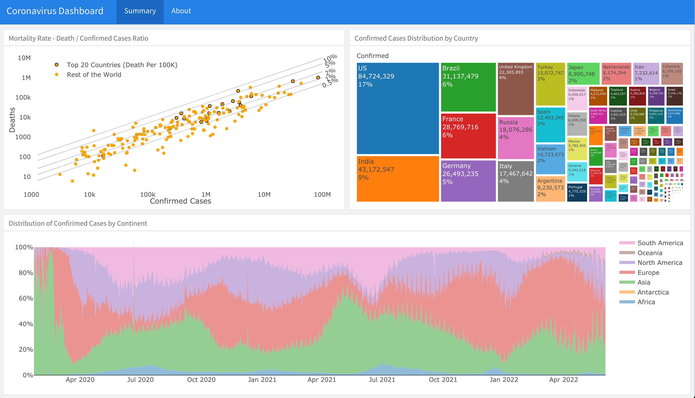

<!-- README.md is generated from README.Rmd. Please edit that file -->

### The Coronavirus Dashboard

This is a supporting dashboard for the
[coronavirus](https://github.com/RamiKrispin/coronavirus) R package. It
provides an overview of the 2019 Novel Coronavirus COVID-19 (2019-nCoV)
epidemic. This dashboard is built with R using the
[Rmakrdown](https://rmarkdown.rstudio.com/) using
[flexdashboard](https://rmarkdown.rstudio.com/flexdashboard/) framework
and can easily reproduce by others. The code behind the dashboard is
available on this
[repo](https://github.com/RamiKrispin/coronavirus_dashboard).

**Data**

The input data for this dashboard is the
[coronavirus](https://github.com/RamiKrispin/coronavirus) R package (dev
version). The data and dashboard is refreshed on a daily bases. The raw
data pulled from the Johns Hopkins University Center for Systems Science
and Engineering (JHU CCSE) Coronavirus
[repository](https://github.com/RamiKrispin/coronavirus-csv)

**Packages**

-   Dashboard interface - the
    [flexdashboard](https://rmarkdown.rstudio.com/flexdashboard/)
    package.
-   Visualization - the [plotly](https://plot.ly/r/) package
-   Data manipulation - [dplyr](https://dplyr.tidyverse.org/),
    [tidyr](https://tidyr.tidyverse.org/) packages

**License**

All the code under this dashboard is completely open-sourced under
[MIT](https://opensource.org/licenses/MIT) license

**Deployment and reproducibly**

The dashboard was deployed to Github docs. If you wish to deploy and/or
modify the dashboard on your Github account, you can apply the following
steps:

-   Fork the dashboard
    [repository](https://github.com/RamiKrispin/coronavirus_dashboard),
    or
-   Clone it and push it to your Github package
-   Here some general guidance about deployment of flexdashboard on
    Github page -
    [link](https://github.com/pbatey/flexdashboard-example)

For any question or feedback, you can either open an
[issue](https://github.com/RamiKrispin/coronavirus_dashboard/issues) or
contact me on [Twitter](https://twitter.com/Rami_Krispin).
